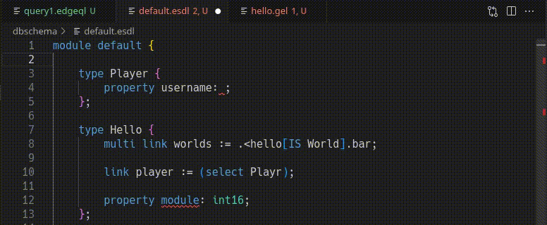

# Gel extension for Visual Studio Code

Extension that provides support for Gel query language (EdgeQL) and Gel Schema Definition Language (ESDL).


(The color scheme used in the screenshot is
[Chromodynamics](https://github.com/MagicStack/Chromodynamics).)

## Features

- syntax highlighting,
- syntax highlighting in embedded code blocks,
- error reporting via language server,

## Language server



When activated (when .edgeql or .esdl files are opened) this extension will
download and start gel-ls, which is the language server for the Gel database.

It will download it into `.local/share/edgedb/gel-ls` on Linux,
into `Library/Application Support/edgedb/gel-ls` and MacOS
or `AppData/Roaming/edgedb/Data/gel-ls` on Windows.
If this installation exists or gel-ls is in system path,
it will not be re-downloaded.


Currently, gel-ls supports a very limited set of features, including only
syntax, type and name error reporting.
It will read `dbschema/` in the root of the workspace and use that schema
to validate any queries found in the workspace.


Multi-workspace projects are not yet supported.

## Syntax highlighting for embedded code blocks

This extension also provides syntax highlighting within string literals of other languages such as JavaScript and Go.
To enable the highlighting, include `# edgeql` in a backtick-quoted string.
This will make it easier to spot syntax errors and make your embedded queries more readable.

```go
// Go
query := `#edgeql
select Example { * };
`
```

```javascript
// JavaScript
const query = `
  # edgeql
  SELECT ... 
`;
```

Other languages are not yet implemented, but we are accepting pull requests at [gel-editor-plugin](https://github.com/gel/gel-editor-plugin).